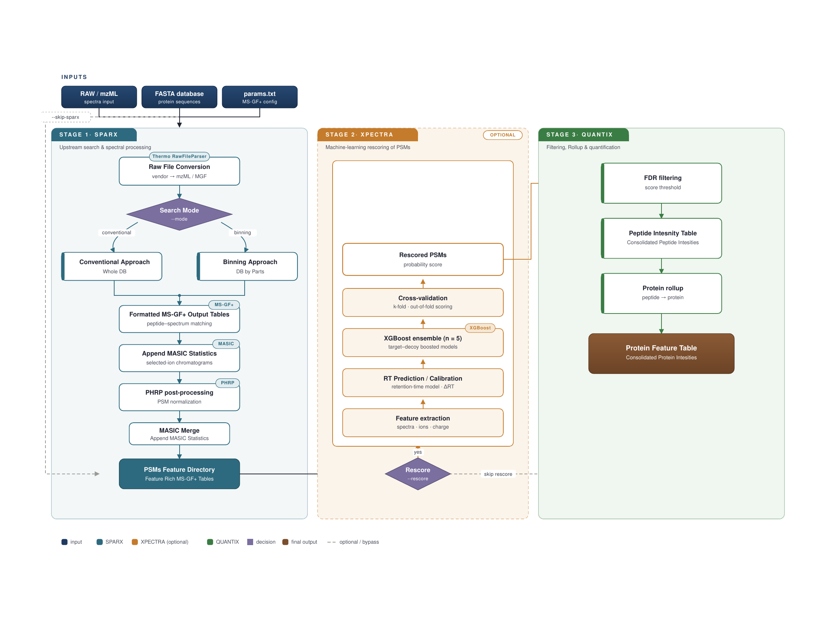

# MSGFLEX — Unified Proteomics Pipeline

[](LICENSE)
[](https://www.python.org/)
[]()
[](https://bioconda.github.io/)

MSGFLEX is a Python pipeline for data-dependent acquisition (DDA) proteomics that
unifies database search, post-processing, machine-learning-based PSM rescoring, and
label-free quantitation into a single, reproducible workflow — driven by either a
command-line interface or a graphical user interface.

---

## Overview



**SPARX** (Stage 1) orchestrates upstream processing: RAW file conversion via
ThermoRawFileParser, database search via MS-GF+ (conventional or binning mode),
SIC extraction via MASIC, PSM normalisation via PHRP, and a final MASIC merge
to produce feature-rich PSM tables.

**XPECTRA** (Stage 2, optional) rescores PSMs using an ensemble XGBoost classifier
with RT prediction and calibration, cross-validation scoring, and target–decoy
boosted models, improving sensitivity at controlled FDR. Enabled with `--rescore`.

**QUANTIX** (Stage 3) performs FDR filtering, peptide intensity consolidation,
protein rollup, and produces the final consolidated Protein Feature Table.

---

## Features

- **Single command** full pipeline: `msgflex run -b /project -c params.txt`
- **Modular execution** — run any stage independently and resume from any checkpoint
- **ML rescoring** via XPECTRA: ensemble XGBoost, isotonic RT calibration, LOWESS
  normalisation, parallel feature extraction
- **Flexible quantitation** via QUANTIX: peptide/protein rollup, FDR estimation,
  cross-sample crosstabs, optional clustering
- **GUI** powered by DearPyGui for point-and-click project setup and run monitoring
- **Reproducible layouts** — all I/O derived from a single project base directory
- **Cross-platform tool resolution** — finds MS-GF+, MASIC, PHRP via env vars,
  conda prefix, or bundled `tools/` directory; `.NET` tools run via Mono on
  Linux

---

## Requirements

| Dependency | Version | Source |
|---|---|---|
| Python | ≥ 3.10 | conda-forge |
| Java (JDK/JRE) | ≥ 11 | `openjdk` via conda-forge |
| Mono *(Linux only)* | any recent | `mono` via conda-forge |
| conda / mamba | any | [Miniforge](https://github.com/conda-forge/miniforge) |

External tools bundled in `tools/` (see [Tool Setup](#tool-setup)):

| Tool | Purpose |
|---|---|
| `MSGFPlus.jar` | Database search engine |
| `MASIC/` | SIC extraction from RAW/mzML |
| `PHRP/` | MSGF+ result post-processing |
| `ThermoRawFileParser/` | RAW → mzML conversion |

---

## Installation

### Option A — Shell installer *(recommended for new users)*

Download the release archive, unpack it, and run:

```bash
bash install.sh  # installs to ~/msgflex (default)
bash install.sh --prefix /opt/msgflex  # custom prefix
```

The installer will:
1. Verify system requirements (Bash 4+, Linux, curl/wget, Java, Mono)
2. Install Miniforge if no conda/mamba is found
3. Create the `msgflex` conda environment from `environment.yml`
4. Register the CLI entry points via `pip install -e .`
   - Optionally installs GUI support (DearPyGui) — prompted during install
5. Set `MSGFLEX_TOOLS_DIR` permanently via conda activation hooks
6. Create a shell launcher (`msgflex`) in `~/.local/bin`
7. Run `msgflex check` to confirm everything is working

> **GUI note:** The installer will ask whether to install DearPyGui. If you
> skip it, you can add it later at any time:
> ```bash
> conda activate msgflex
> pip install "msgflex[gui]"
> ```

### Option B — Desktop installer *(double-click, Linux desktop only)*

For users who prefer a graphical double-click experience, run the desktop
setup script once after extracting the bundle:

```bash
bash setup_desktop.sh
```

This will:
1. Detect your terminal emulator (GNOME, KDE, XFCE, MATE, or xterm)
2. Install the MSGFLEX icon to `~/.local/share/icons/`
3. Generate and register a `.desktop` launcher in `~/.local/share/applications/`
4. Optionally place a shortcut on `~/Desktop`

After setup, double-clicking the **MSGFLEX Installer** icon opens a terminal
and runs `install.sh` automatically. The `setup_desktop.sh` step is only
needed once — the desktop icon persists across reboots.

> **To unregister the desktop entry:**
> ```bash
> rm ~/.local/share/applications/MSGFLEX.desktop
> rm ~/Desktop/MSGFLEX.desktop   # if Desktop shortcut was created
> ```

### Option C — Bioconda *(coming soon)*

```bash
conda install -c bioconda -c conda-forge msgflex
```

The conda package bundles MSGFPlus, MASIC, and PHRP automatically. DearPyGui
(GUI) is installed via a post-link pip step; set `MSGFLEX_SKIP_GUI=1` on
headless systems to skip it.

### Option D — Manual installation route with conda *(developers)*

```bash
git clone https://github.com/thulasis/msgflex.git
cd msgflex
bash fetch_tools.sh # downloads tools/ from the latest GitHub release
conda env create -f environment.yml
conda activate msgflex
pip install -e ".[dev]"
pip install dearpygui #if GUI is needed
export MSGFLEX_TOOLS_DIR="$PWD/tools"
msgflex check
msgflex -V #for version
```
---

## Bundle Layout
After extracting the release archive, the bundle contains:

```
msgflex-bundle/
├── install.sh # main installer — run this first
├── setup_desktop.sh # optional: register double-click desktop icon (Linux)
├── MSGFLEX_Pipeline.png # gives the overall picture of pipeline
├── environment.yml # conda environment specification
├── pyproject.toml  # Python package definition
└── tools/ # bundled third-party tools (see Tool Setup below)
```

---

## Tool Setup

Tools are resolved in this priority order for every executable:

1. **Environment variable** — e.g. `MSGFLEX_MSGFPLUS_JAR=/path/to/MSGFPlus.jar`
2. **Conda prefix** — `$CONDA_PREFIX/share/msgflex/tools/` (set by Bioconda install)
3. **Bundled directory** — `<repo_root>/tools/` (set by `install.sh` via `MSGFLEX_TOOLS_DIR`)

Expected layout under `tools/`:

```
tools/
├── MSGFPlus.jar
├── MASICParameters.xml
├── MASIC/
│   └── MASIC_Console.exe
├── PHRP/
│   ├── PeptideHitResultsProcRunner.exe
│   ├── MSGFDB_Mods.txt
│   └── Mass_Correction_Tags.txt
└── ThermoRawFileParser/
    └── ThermoRawFileParser.exe
```

Run `msgflex check` at any time to see which tools are found and which are missing.

---

## Project Layout

MSGFLEX expects (and creates) a standard directory layout under a project base directory:

```
/path/to/project/
├── data/  # input .RAW files
├── database/ # FASTA database files
├── inputfile.tsv # auto-generated sample decoder
├── QCdir/ # TIC QC plots
├── SICdir/ # SPARX final output (merged SIC-stats)
├── results/ #got MS-GF+ derived .tsv files
│   ├── PHRPOut/ # per-sample PHRP results
│   └── MasicOut/ # per-sample MASIC results
├── xpectra/ # XPECTRA output (if --rescore used)
│   ├── features/
│   ├── rescored/
│   ├── stats/
│   └── logs/
└── peptide_crosstab.tsv  # QUANTIX final LFQ table
```

All paths are derived from `--base`.

---

## Usage

### Preflight check

```bash
msgflex check  # verify tools + environment
msgflex check -b /path/to/project # also verify project layout
```

### Full pipeline (recommended)

```bash
msgflex run \
    --base /path/to/project \
    --config params.txt \
    --rescore # optional: enable XPECTRA ML rescoring
```

### Stage-by-stage

```bash
# Stage 1 — upstream search + SIC extraction
msgflex sparx \
    --base /path/to/project \
    --config params.txt \
    --mode conventional # or: binning

# Stage 2 — ML rescoring (optional)
msgflex xpectra \
    --base /path/to/project \
    --ensemble 5 \
    --folds 5

# Stage 3 — LFQ quantitation
msgflex quantix \
    --base /path/to/project \
    --score-field MSMSScore \
    --threshold 10
```

### Graphical interface

```bash
msgflex-gui
```

The GUI provides a tabbed interface for project configuration, parameter editing,
stage selection, and real-time log monitoring. Requires DearPyGui, which is
optionally installed by `install.sh` (prompted during install) or added manually:

```bash
conda activate msgflex
pip install "msgflex[gui]"
```

## Configuration

The `--config` file (plain text, `key = value`) controls MS-GF+ search parameters.
A minimal example:

```
instrument = 3              # 0=Low-res LCQ/LTQ, 3=Q-Exactive
fragmentation = 3           # 3=HCD
protocol = 0                # 0=NoProtocol
minCharge = 2
maxCharge = 4
minPepLength = 6
maxPepLength = 50
numMods = 3
```

Full parameter documentation: `msgflex sparx --help`

---

## Environment Variables

| Variable | Purpose |
|---|---|
| `MSGFLEX_TOOLS_DIR` | Root directory containing all bundled tools |
| `MSGFLEX_MSGFPLUS_JAR` | Direct path override for `MSGFPlus.jar` |
| `MSGFLEX_MASIC_PATH` | Direct path override for `MASIC_Console.exe` |
| `MSGFLEX_PHRP_PATH` | Direct path override for `PeptideHitResultsProcRunner.exe` |
| `MSGFLEX_SKIP_GUI` | Set to `1` to skip DearPyGui install on headless systems |
| `JAVA_HOME` | Respected for Java discovery (standard convention) |

---

## Development

```bash
git clone https://github.com/thulasis/msgflex.git
cd msgflex
conda env create -n msgflex -f environment.yml
conda activate msgflex
pip install -e ".[dev]"

# Run tests
pytest

# Lint + type check
ruff check msgflex/
mypy msgflex/
```

Tests do not require any external tools to be installed — tool resolver tests use
environment variable overrides and temporary paths.

---

## Citation

If you use MSGFLEX in published work, please cite:

> MSGFLEX Team. *MSGFLEX: An optimized end-to-end pipeline for metaproteomics,
> analysis built on MS-GF+ with dedicated rescoring model, XPECTRA.*
> (manuscript in preparation)

MSGFLEX builds on and should also cite:

- Kim et al. (2014) MS-GF+ — *Nature Communications*
- Monroe et al. MASIC — *PNNL Comp Mass Spec*
- Payne et al. PHRP — *PNNL Comp Mass Spec*

---

## License

MSGFLEX is released under the [Apache License](LICENSE).

The bundled third-party tools (MS-GF+, MASIC, PHRP, ThermoRawFileParser) are
subject to their own respective licenses. See each tool's documentation for details.

---

## Contributing

Pull requests are welcome. Please open an issue first to discuss major changes.
Ensure all tests pass and `ruff` + `mypy` report no errors before submitting.
